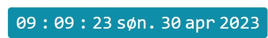
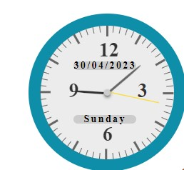

# Double Clock

This is a digitalclock that turns into a analoge clock when clicked on.

##### Description

Simple digital clock appears on page (bottom right corner) when loaded.

The digital clock shows time in hh:mm:ss day date month year
(updates every second)

When clicked on it turnes into an analoge clock that shows the time 
-and also has day date/month/year

From this:

To this:

## External libraries or plugins

* Icon linked in the html file **plugins**
    * [Icon](href="https://unicons.iconscout.com/release/v4.0.0/css/line.css")

* jQuery JavaScript external Library v3.5.0 
    * this is an external library in the project - and is linked in the html("https://ajax.googleapis.com/ajax/libs/jquery/3.6.0/jquery.min.js")

### Webpage

https://doubleclock.onrender.com/

## Contributing
ME :) Yes me :)
**Signed: Janne Marie Tvetene**
